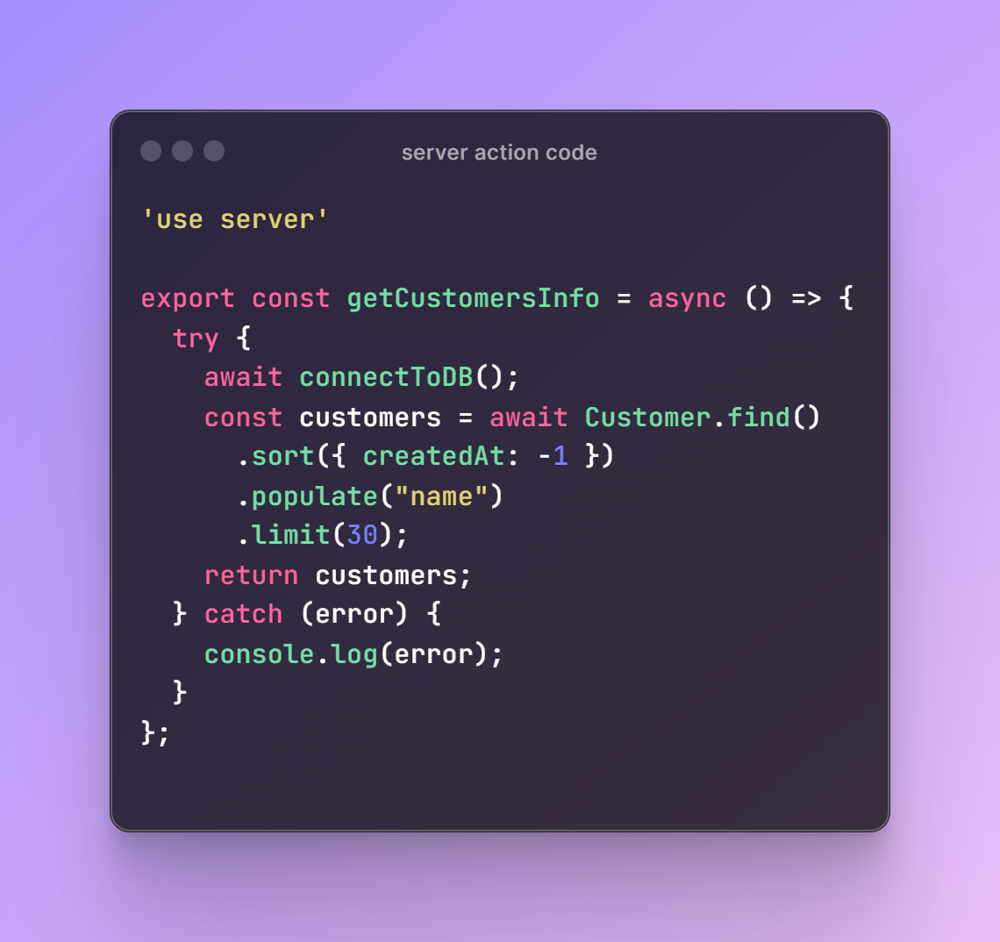

# Gym Membership Management 

## About

> I got this project idea to solve the problem of my gym where the owner manages the membership process through manual paper works.

## Tech Stack

- Next JS (App Router)
- Clerk (for Authentication and Authorization)
- MongoDB
- ShadCN

## Features

- Authentication and Authorization
- CRUD (for both membership and body measurements)
- Filter (New Members, 1 Month, 3 Months, Expire Soon)
- Search

## Set up

Step 1: Install Next JS in your local development environment (Ref: [Next.JS official documentation (https://nextjs.org/docs/getting-started/installation)])

Step 2: Install Clerk library and create your own API keys, save it in `.env.local` ([Official Documentation (https://clerk.com/docs/quickstarts/nextjs)])

Step 3: Install Shadcn ([Official Documentation (https://ui.shadcn.com/docs/installation/next)])

Step 4: Choose your own database (MySQL, MongoDB, PostgreSQL,...) and start Coding🥳🥳

## What is Server Action

Asynchronous functions which are executed on servers and can be used in both "client" and "server" components for data fetching and mutation.

With server actions, there is no need to use `api routes` for http methods, "POST, GET, PATCH, PUT, DELETE". All of these can be performed by function execution.

In the previous version, api routes are used to hanlde http methods. In this version, server actions are used.

## Reference

[Using forms in Next JS](https://youtu.be/RadgkoJrhu0?si=QvSgYEvAMjNG9T3Y)

[Next.js server actions](https://youtu.be/RadgkoJrhu0?si=QvSgYEvAMjNG9T3Y)

